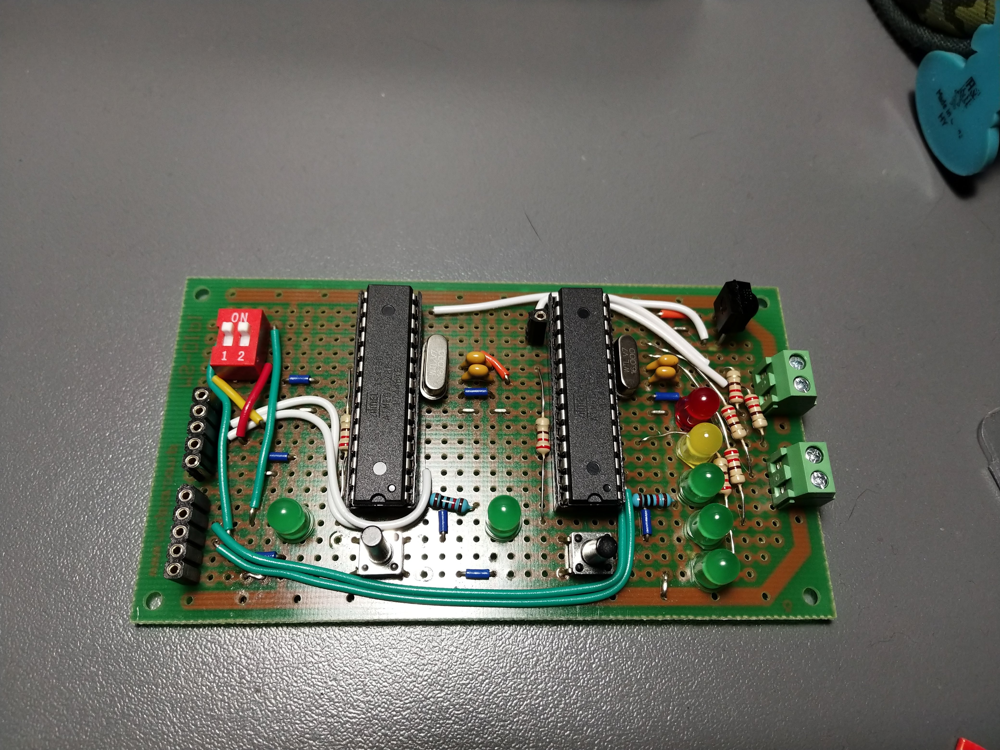
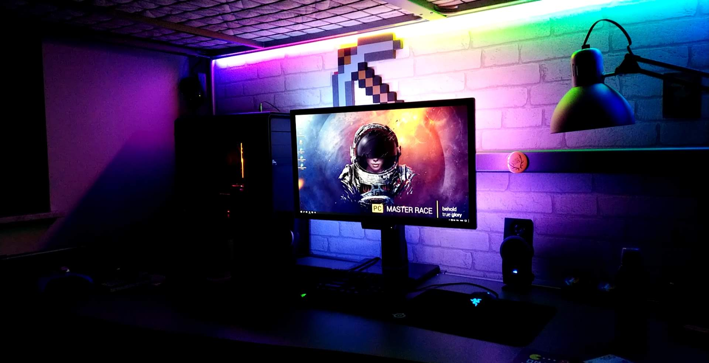

# Arduino-WS2812b-Strip-IR-controlled
Code for my arduino prototyped board to controll WS2812b strip by IR controll.
This code combines the Adafruit NeoPixel library and the IRremote library to create a remote controllable LED strip.
# Photos and Demo Video

Demo Video: 
